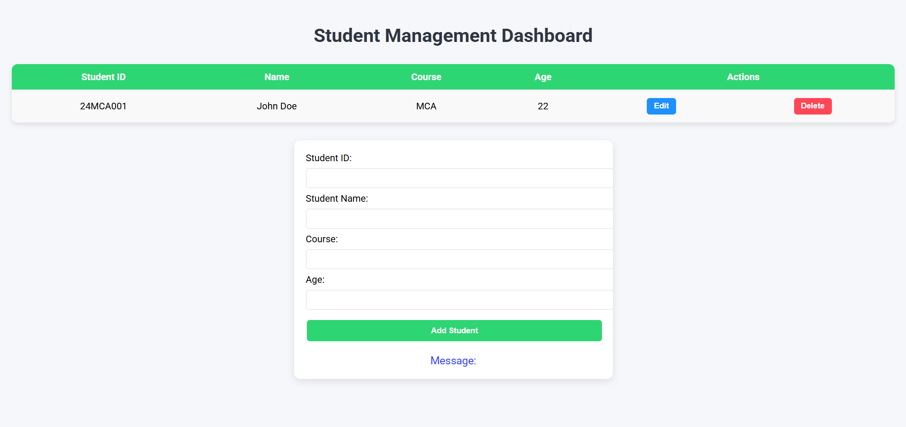

# 🚀 MEAN-CRUD Application

---


---

Welcome to the **MEAN-CRUD** project! This is a simple and powerful CRUD (Create, Read, Update, Delete) application built using the MEAN stack (MongoDB, Express, AngularJS, Node.js) — focusing primarily on the **backend** with **MongoDB**, **Express**, and **Mongoose**.

> ⚙️ Built with simplicity, structured for scalability, and spiced up with a touch of elegance.

---

## 🧰 Prerequisites

Before you get started, make sure you have the following installed:

- 🟢 [Node.js](https://nodejs.org/) – JavaScript runtime
- 🍃 [MongoDB Compass](https://www.mongodb.com/products/compass) – Visual GUI for MongoDB 🧩 *(Required for viewing & managing your database)*
- 🔌 [MongoDB Server](https://www.mongodb.com/try/download/community) – MongoDB must be running locally or remotely
- 🚂 [Express.js](https://expressjs.com/) – Fast, minimalist web framework for Node.js
- 🧬 [Mongoose](https://mongoosejs.com/) – Elegant MongoDB object modeling for Node.js

Make sure MongoDB is running either via Compass or the command line before starting the server.

---

## ⚙️ Installation & Setup

Follow these steps to set up and run the project locally:

1. 📁 **Clone the repository:**

   ```bash
   git clone https://github.com/rahull0328/MEAN-CRUD.git
   ```

2. 📦 Install all dependencies:

    ```bash
    npm install i
    ```

3.  Connect to MongoDB:

- Make sure your MongoDB server is running.

- Modify the connection.js file to use your correct connection URI if needed.

4. ▶️ Start the server:

    ```bash
    cd MEAN-CRUD
    node connection.js
    ```

5. ✅ You’re all set! Your server should now be running on http://127.0.0.1:3000 and connected to MongoDB.

---

💡 Features

🔄 Create, Read, Update, Delete operations

🌐 Express-based RESTful API

⚡ Fast and efficient MongoDB operations via Mongoose

🧩 Easy to extend for frontend integration (AngularJS/React/Vue)


